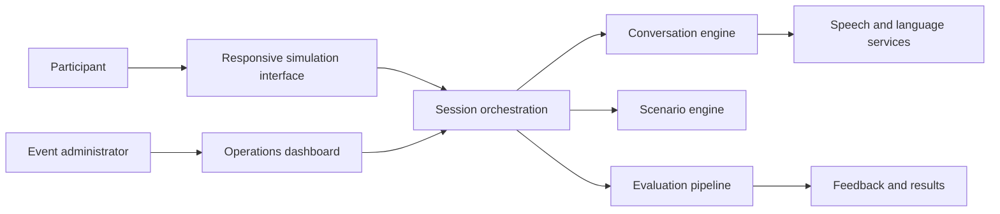

# AI Customer Experience Simulation

> A privacy-safe portfolio case study about designing an AI-supported customer interaction simulation.

This repository presents a **sanitized product overview**. It demonstrates the product thinking, experience design and engineering practices behind a real-time customer interaction simulation without exposing production source code, organizational information, customer data or internal business processes.

## What the product does

The experience places a participant in a realistic customer conversation. The participant listens, asks questions, reviews concise contextual information and chooses appropriate actions. After the conversation, the system provides structured feedback on communication quality and experience management.

The main design goals were:

- natural and responsive voice interaction;
- scenarios that feel credible without requiring specialist operational knowledge;
- clear guidance that does not interrupt the conversation;
- explainable feedback focused on empathy, communication and resolution ownership;
- a responsive experience for desktop and mobile use;
- simple event operations for participants and administrators.

## My contribution

- Product scope and end-to-end participant journey
- Scenario and customer-persona framework
- Conversational AI behavior and evaluation design
- Backend and real-time session orchestration
- Participant, administrator and leaderboard experiences
- Responsive UX refinement and accessibility considerations
- Testing, release validation and production handover documentation
- Privacy-aware separation of configuration, runtime data and source code

## What this case study demonstrates

| Discipline | Applied capability |
| --- | --- |
| AI product management | Turning an open-ended conversational AI idea into a bounded, testable participant journey |
| Experience design | Reducing cognitive load while preserving realism, emotion and participant agency |
| Domain modeling | Converting complex service situations into reusable scenario, persona and action structures |
| Conversational AI | Designing turn-taking, emotional behavior, response timing and graceful conversation closure |
| Evaluation design | Translating observable behaviors into structured, explainable developmental feedback |
| Engineering | Orchestrating real-time sessions, state transitions, data boundaries and recovery paths |
| Delivery leadership | Iterating through field feedback, release gates, operational documentation and handover |

## High-level architecture

## Product principles

1. **Human experience first:** Success depends on listening, empathy and clear ownership.
2. **Realism with accessibility:** Scenarios are credible but remain manageable for employees from different roles.
3. **Low cognitive load:** Supporting information appears in short, purposeful layers.
4. **Explainable feedback:** Participants can understand what helped or harmed the interaction.
5. **Operational readiness:** The flow supports event entry, session control, results and recovery paths.

## Technology overview

- Python web backend
- Real-time bidirectional communication
- Speech-enabled conversational AI
- Configurable scenario and persona model
- Structured AI-assisted evaluation
- Responsive HTML, CSS and JavaScript interface
- Automated release and configuration checks

Specific providers, model deployments, prompts, scoring rules and production architecture are intentionally omitted.

## Explore the approach

- [Sanitized product case study](docs/CASE_STUDY.md) — the challenge, experience flow and key design choices
- [Product decisions](docs/PRODUCT_DECISIONS.md) — how realism, usability and event constraints were balanced
- [AI quality approach](docs/AI_QUALITY_APPROACH.md) — quality dimensions, test layers and failure handling

## Repository scope

This public repository contains **documentation only**. It does not contain:

- production application source code;
- real or internal customer scenarios;
- organizational names, logos or brand assets;
- prompts, scoring weights or evaluation rubrics;
- API keys, endpoints, tokens or environment files;
- participant records, analytics or operational data;
- deployment instructions or infrastructure configuration.

---

## Türkçe özet

Bu depo, gerçek zamanlı müşteri görüşmesi simülasyonu için hazırlanan **anonimleştirilmiş bir portföy çalışmasıdır**. Ürünün kaynak kodunu veya kuruma ait bilgileri paylaşmadan; ürün tasarımı, konuşma deneyimi, senaryo modeli, değerlendirme yaklaşımı, kullanıcı deneyimi ve canlıya hazırlık çalışmalarını genel hatlarıyla gösterir.

Üretim kodu, gerçek vakalar, kurum bilgileri, istemler, puanlama kuralları, servis adresleri ve kullanıcı verileri bilinçli olarak bu deponun dışında tutulmuştur.

## Contact

GitHub: [@msakirmazlum](https://github.com/msakirmazlum)

