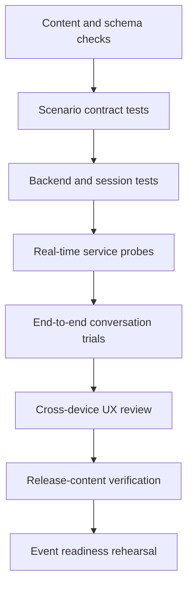

# AI Quality Approach

Conversational AI quality cannot be represented by model fluency alone. A convincing simulation must combine natural dialogue, controlled scenario behavior, fair evaluation, resilient software and clear user experience.

## Quality model

| Layer | Core question | Example evidence |
| --- | --- | --- |
| Conversation | Does the interaction sound responsive, coherent and emotionally appropriate? | Turn timing, interruption behavior, persona consistency, natural closure |
| Scenario integrity | Does the customer stay within the intended situation and reveal information appropriately? | Fact consistency, progressive disclosure, boundary adherence |
| Experience validity | Can participants from different roles engage without hidden specialist knowledge? | Briefing clarity, action simplicity, comparable difficulty |
| Evaluation integrity | Does feedback reflect observable behavior in the actual conversation? | Evidence-linked comments, complete output, score-feedback consistency |
| Product usability | Can the participant remain focused on the customer? | Readability, navigation effort, responsive layout, accessible states |
| Operational resilience | Can the event continue when a dependency or session fails? | Recovery paths, retry controls, isolated sessions, diagnostic visibility |

## Evaluation dimensions

The evaluation framework focuses on behaviors that can be demonstrated during the interaction:

- discovery and active listening;
- empathy and emotional acknowledgment;
- clarity and expectation management;
- ownership and appropriate next steps;
- trust-building communication;
- structured, respectful closure.

Scores are useful only when they remain aligned with narrative feedback. A high result should be supported by specific effective behaviors; a low result should identify clear, actionable improvement areas. Exact prompts, weights and thresholds are intentionally outside the scope of this repository.

## Test layers

Each layer answers a different question. Schema validation cannot prove conversational quality; a successful voice call cannot prove evaluation integrity; a polished participant screen cannot prove operational recovery. Release confidence comes from combining these checks.

## Important failure modes

| Failure mode | Product response |
| --- | --- |
| Slow or awkward turn-taking | Calibrate voice activity detection and response timing in the target environment |
| Customer leaves the scenario | Reinforce scenario boundaries and validate persona consistency through conversation trials |
| Conversation ends mid-sentence | Separate logical completion from audio completion and allow a short closure window |
| Evaluation output is incomplete | Validate structure before publishing a result and provide a safe retry path |
| Dependency is unavailable | Preserve the session record, explain the state clearly and avoid presenting fabricated precision |
| Supporting tools distract the participant | Reduce text, keep panels reversible and reveal only context needed at that moment |
| Event data appears inconsistently | Define one record source, explicit visibility controls and deterministic result states |

## Responsible delivery boundaries

- Secrets and environment configuration remain outside source control.
- Runtime participant information is separated from application files.
- Public artifacts use generalized language and contain no real transcripts.
- Administrative capabilities are separated from the participant flow.
- AI-generated evaluation is treated as structured feedback, with validation and failure handling around it.
- Release packages are checked for both technical completeness and unintended data exposure.

This approach treats safety and privacy as delivery requirements, not as documentation added after implementation.

