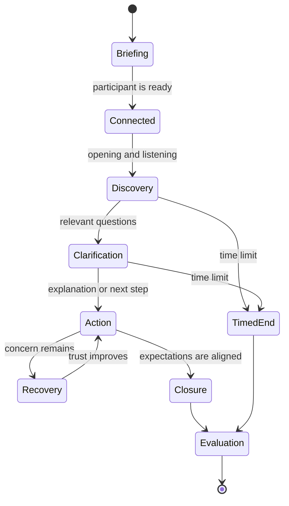

# Product Decisions

This document describes the decision-making approach behind the simulation. It is intentionally provider-neutral and excludes organization-specific workflows, scenarios and implementation details.

## Product framing

The product is an experiential learning environment rather than a process exam. Its purpose is to reveal how a participant listens, communicates, manages uncertainty and takes ownership during a difficult customer interaction.

That framing created several design tensions:

| Tension | Product decision | Reasoning |
| --- | --- | --- |
| Realism vs. accessibility | Keep the customer situation credible; make operational actions lightweight | Participants from different roles should be able to succeed through sound judgment and communication |
| Depth vs. event duration | Reveal information progressively | A short session can still feel rich without front-loading long text |
| Freedom vs. consistency | Allow open conversation inside a structured scenario contract | The participant retains agency while the experience remains assessable |
| Emotion vs. fairness | Let customer emotion react to observable participant behavior | Difficulty comes from the conversation, not arbitrary model behavior |
| AI flexibility vs. reliability | Combine generative behavior with deterministic session rules | Timing, completion, records and event operations need predictable boundaries |
| Competition vs. learning | Pair a score with evidence-based feedback | Ranking creates energy; explanation creates developmental value |

## Scenario design contract

Each scenario is treated as a product object with a consistent internal structure:

1. **Customer context** — who the customer is and why the situation matters to them.
2. **Trigger** — the event that caused contact, stated in plain language.
3. **Known facts** — concise information available to the participant.
4. **Hidden needs** — emotional or practical needs that emerge through discovery.
5. **Behavioral signals** — what builds or reduces trust during the conversation.
6. **Permitted actions** — simple, credible actions that support the conversation.
7. **Resolution boundary** — what can realistically be promised within the interaction.
8. **Closure conditions** — the behaviors required for a clear and respectful ending.

This contract separates the durable experience logic from individual scenario content. It also makes content review more systematic: language, difficulty, actionability and evaluation relevance can be checked independently.

## Conversation state model

The state model is conceptual. The live conversation remains natural; the states help the product reason about guidance, emotional progression, completion and failure recovery.

## Interaction design choices

### Before the conversation

The participant receives enough context to begin confidently, but not a full operational dossier. Customer identity, the core situation and the participant's objective are visually separated for rapid scanning.

### During the conversation

Supporting records and actions remain secondary to the customer. They use progressive disclosure, short labels and reversible navigation so that checking information does not feel like leaving the conversation.

### After the conversation

The result moves from headline feedback to supporting evidence. Participants first understand the overall outcome, then inspect strengths, improvement areas and emotional change in more detail.

## Validation signals

The design can be evaluated without exposing proprietary analytics. Useful signals include:

- time required to understand the briefing;
- delay before the participant begins speaking;
- frequency and duration of tool-panel use;
- conversation completion and retry patterns;
- whether feedback references observable moments;
- participant understanding of the final result;
- operational effort required per event session.

These signals connect user experience, AI behavior and event operations instead of assessing them as separate systems.

